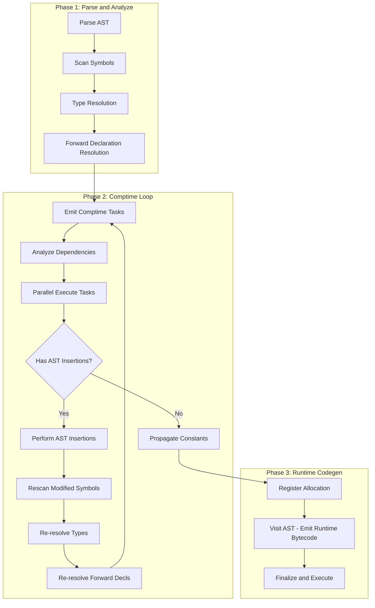

# Comptime Bytecode Generation and Result Merger Architecture

This plan implements the discussed architecture for compile-time code execution with support for parallel execution, symbol table injection, and AST code injection.

## Architecture Overview



## File Changes Summary

| File | Change Type | Description |

|------|-------------|-------------|

| `include/comptime_scheduler.h` | NEW | ComptimeTask and ComptimeScheduler definitions |

| `src/comptime_scheduler.cpp` | NEW | Scheduler implementation with parallel execution |

| `include/bytecode_builder.h` | MODIFY | Add dual-target emission support |

| `src/builders.cpp` | MODIFY | Implement comptime emission context |

| `include/codegen.h` | MODIFY | Add comptime scheduler integration |

| `src/codegen.cpp` | MODIFY | Add `visit_run_directive()` for task emission |

| `src/compiler.cpp` | MODIFY | Integrate comptime phase into pipeline |

| `include/node_manager.h` | MODIFY | Add AST modification operations |

| `src/node_manager.cpp` | MODIFY | Implement replace/splice/remove nodes |

| `include/parser.h` | MODIFY | Add fragment parsing mode |

| `src/parser.cpp` | MODIFY | Implement `parse_fragment()` |

| `include/interpreter.h` | MODIFY | Support isolated execution |

| `src/interpreter.cpp` | MODIFY | Add `execute_range()` method |

| `include/symbols.h` | MODIFY | Add comptime constant tracking |

| `src/symbols.cpp` | MODIFY | Implement symbol snapshotting |

| `include/error_logger.h` | MODIFY | Add thread-safe logging |

| `src/error_logger.cpp` | MODIFY | Implement concurrent error queue |

| `CMakeLists.txt` | MODIFY | Add threading library and new source files |

---

## Part 1: Core Data Structures

### 1.1 Create `include/comptime_scheduler.h`

```cpp
#pragma once

#include <vector>
#include <map>
#include <set>
#include <atomic>
#include <mutex>
#include <condition_variable>
#include "sage_bytecode.h"
#include "symbols.h"
#include "node_manager.h"

enum class InsertionType {
    NONE,           // Result is a simple value
    CODE_STRING,    // Result is source code to parse and insert
    AST_NODE        // Result is a pre-built AST node (future)
};

struct ComptimeTask {
    int task_id;
    NodeIndex ast_node;                     // The #run directive node
    int scope_id;                           // Scope where #run appears
    bytecode code;                          // Self-contained bytecode
    vector<int> dependencies;               // Task IDs this depends on
    
    // Captured state for isolated execution
    vector<symbol_entry> captured_symbols;
    map<int, int> proc_line_locations;
    
    // Results (populated after execution)
    SageValue result;
    string result_code_string;              // For CODE_STRING insertion
    InsertionType insertion_type = InsertionType::NONE;
    bool completed = false;
    bool has_error = false;
    string error_message;
};

class ComptimeScheduler {
public:
    vector<ComptimeTask> tasks;
    map<NodeIndex, int> node_to_task_id;
    map<string, int> symbol_producer;       // symbol name -> task_id that produces it
    
    // Dependency graph
    map<int, set<int>> dependents;          // task_id -> tasks that depend on it
    map<int, atomic<int>> pending_deps;     // task_id -> remaining dependency count
    
    // Execution state
    mutex queue_mutex;
    condition_variable queue_cv;
    atomic<int> completed_count{0};
    bool execution_failed = false;
    
    // Statistics
    int iteration_count = 0;
    static constexpr int MAX_ITERATIONS = 10;
    
    ComptimeScheduler();
    
    int next_id();
    void submit(ComptimeTask task);
    void clear_completed_tasks();
    
    // Dependency analysis
    optional<int> find_producer(const string& symbol_name);
    void build_dependency_graph();
    
    // Execution
    void execute_parallel(int thread_count);
    void execute_task(ComptimeTask& task);
    
    // Result propagation
    void propagate_constants(SageSymbolTable& table, NodeManager* nm);
    bool has_ast_insertions() const;
    void perform_ast_insertions(
        NodeManager* node_manager,
        SageParser* parser,
        ScopeManager* scope_manager
    );
    
    bool needs_another_iteration() const;
    void reset_for_iteration();
};
```

### 1.2 Create `src/comptime_scheduler.cpp`

Implement the scheduler with:

- Task submission and ID generation
- Dependency graph construction using topological analysis
- Work-stealing parallel execution using `std::thread`
- Constant propagation back to symbol table
- AST insertion via fragment parsing

Key parallel execution logic:

```cpp
void ComptimeScheduler::execute_parallel(int thread_count) {
    // Initialize pending dependency counts
    for (auto& task : tasks) {
        pending_deps[task.task_id].store(task.dependencies.size());
    }
    
    // Concurrent ready queue
    queue<int> ready_queue;
    for (auto& task : tasks) {
        if (task.dependencies.empty()) {
            ready_queue.push(task.task_id);
        }
    }
    
    // Launch worker threads
    vector<thread> workers;
    for (int i = 0; i < thread_count; i++) {
        workers.emplace_back([this, &ready_queue]() {
            while (completed_count < tasks.size() && !execution_failed) {
                int task_id = -1;
                {
                    unique_lock<mutex> lock(queue_mutex);
                    queue_cv.wait(lock, [&]() {
                        return !ready_queue.empty() || 
                               completed_count >= tasks.size() ||
                               execution_failed;
                    });
                    if (ready_queue.empty()) continue;
                    task_id = ready_queue.front();
                    ready_queue.pop();
                }
                
                execute_task(tasks[task_id]);
                
                // Unblock dependents
                for (int dep_id : dependents[task_id]) {
                    if (--pending_deps[dep_id] == 0) {
                        lock_guard<mutex> lock(queue_mutex);
                        ready_queue.push(dep_id);
                        queue_cv.notify_one();
                    }
                }
            }
        });
    }
    
    for (auto& w : workers) w.join();
}
```

---

## Part 2: BytecodeBuilder Modifications

### 2.1 Modify `include/bytecode_builder.h`

Add dual-target emission support:

```cpp
struct BytecodeBuilder {
    // Existing fields...
    map<int, procedure_frame> runtime_procedures;   // Rename from 'procedures'
    map<int, procedure_frame> comptime_procedures;  // NEW
    
    bool emitting_comptime = false;                 // NEW
    stack<int> comptime_procedure_stack;            // NEW
    int comptime_instruction_count = 0;             // NEW
    
    // Active target selection
    map<int, procedure_frame>& active_procedures();
    stack<int>& active_stack();
    
    // Comptime emission control
    void enter_comptime();
    void exit_comptime();
    bool is_emitting_comptime() const;
    
    // Finalization
    bytecode final_runtime(map<int, int>& proc_locations, SageSymbolTable* table);
    bytecode final_comptime_task(int task_id, map<int, int>& proc_locations);
    void reset_comptime();
    
    // Existing methods remain unchanged in signature...
};
```

### 2.2 Modify `src/builders.cpp`

Implement the dual-target routing:

```cpp
map<int, procedure_frame>& BytecodeBuilder::active_procedures() {
    return emitting_comptime ? comptime_procedures : runtime_procedures;
}

stack<int>& BytecodeBuilder::active_stack() {
    return emitting_comptime ? comptime_procedure_stack : procedure_stack;
}

void BytecodeBuilder::enter_comptime() {
    emitting_comptime = true;
}

void BytecodeBuilder::exit_comptime() {
    emitting_comptime = false;
}

// Update ALL build_* methods to use active_procedures() and active_stack()
// Example:
void BytecodeBuilder::build_im(SageOpCode opcode, SageValue op) {
    int encoding[4] = {0, 0, 0, 0};
    active_procedures()[active_stack().top()].procedure_instructions
        .push_back(command(opcode, op.as_operand(), encoding));
    
    if (emitting_comptime) {
        comptime_instruction_count++;
    } else {
        total_instruction_count++;
    }
}
```

---

## Part 3: Compiler Integration

### 3.1 Modify `include/codegen.h`

Add scheduler and comptime state:

```cpp
#include "comptime_scheduler.h"

class SageCompiler {
public:
    // Existing fields...
    
    ComptimeScheduler comptime_scheduler;           // NEW
    BytecodeBuilder* current_builder;               // NEW: for swapping during comptime emit
    bool in_comptime_emission = false;              // NEW
    
    // NEW methods
    void emit_comptime_tasks(NodeIndex root);
    ui32 visit_run_directive(NodeIndex node);
    vector<int> analyze_comptime_dependencies(NodeIndex run_node);
    void rescan_modified_symbols(NodeIndex root);
    
    // Existing methods...
};
```

### 3.2 Modify `src/codegen.cpp`

Add the `visit_run_directive` implementation:

```cpp
ui32 SageCompiler::visit_run_directive(NodeIndex node) {
    // 1. Create task
    ComptimeTask task;
    task.task_id = comptime_scheduler.next_id();
    task.ast_node = node;
    task.scope_id = node_manager->get_scope_id(node);
    
    // 2. Snapshot visible symbols
    task.captured_symbols = symbol_table.snapshot_visible(task.scope_id);
    
    // 3. Create isolated builder for this task
    BytecodeBuilder task_builder;
    string frame_name = "__run_" + to_string(task.task_id);
    task_builder.new_frame(frame_name);
    task_builder.build_im(OP_LABEL, hash_djb2(frame_name));
    
    // 4. Swap context and emit
    BytecodeBuilder* saved = current_builder;
    current_builder = &task_builder;
    
    NodeIndex block = node_manager->get_branch(node);
    visit(block);
    
    // 5. Add return if block doesn't have one
    task_builder.build_im(VOP_EXIT, 0);
    task_builder.exit_frame();
    
    current_builder = saved;
    
    // 6. Finalize task bytecode
    task.code = task_builder.final_comptime_task(
        task.task_id, 
        task.proc_line_locations
    );
    
    // 7. Analyze dependencies
    task.dependencies = analyze_comptime_dependencies(node);
    
    // 8. Determine insertion type from context
    NodeIndex parent = node_manager->get_parent(node);
    if (node_manager->get_nodetype(parent) == PN_VAR_DEC) {
        task.insertion_type = InsertionType::NONE;  // Value injection
    }
    // Add more context detection as needed
    
    // 9. Submit
    comptime_scheduler.submit(std::move(task));
    
    return SAGE_NULL_SYMBOL;
}
```

Update `visit_statement` to route to new method:

```cpp
case PN_RUN_DIRECTIVE: {
    if (in_comptime_emission) {
        // Emit bytecode for nested #run (will be task dependency)
        auto blocknode = node_manager->get_branch(node);
        return visit(blocknode);
    }
    return visit_run_directive(node);
}
```

### 3.3 Modify `src/compiler.cpp`

Integrate comptime phase into `compile_file`:

```cpp
void SageCompiler::compile_file(string mainfile) {
    // ... existing parse, symbol scan, type resolution, forward decl ...
    
    // ═══════════════════════════════════════════════════════
    // NEW: Comptime Execution Phase
    // ═══════════════════════════════════════════════════════
    
    current_builder = &builder;
    bool needs_reanalysis = false;
    
    do {
        needs_reanalysis = false;
        comptime_scheduler.iteration_count++;
        
        if (comptime_scheduler.iteration_count > ComptimeScheduler::MAX_ITERATIONS) {
            logger.log_error("compiler.cpp", -1, 
                "Comptime iteration limit exceeded - possible infinite expansion", 
                SEMANTIC);
            return;
        }
        
        // Emit comptime tasks (visits only #run nodes)
        in_comptime_emission = false;
        emit_comptime_tasks(ast_root);
        
        if (comptime_scheduler.tasks.empty()) break;
        
        // Build dependency graph
        comptime_scheduler.build_dependency_graph();
        
        // Execute in parallel
        int thread_count = std::min(
            (int)comptime_scheduler.tasks.size(),
            (int)std::thread::hardware_concurrency()
        );
        comptime_scheduler.execute_parallel(thread_count);
        
        if (logger.has_errors()) {
            logger.report_errors();
            return;
        }
        
        // Propagate constant results
        comptime_scheduler.propagate_constants(symbol_table, node_manager);
        
        // Handle AST insertions
        if (comptime_scheduler.has_ast_insertions()) {
            comptime_scheduler.perform_ast_insertions(
                node_manager, &parser, &scope_manager
            );
            
            needs_reanalysis = true;
            
            // Re-run analysis on modified AST
            rescan_modified_symbols(ast_root);
            perform_type_resolution();
            forward_declaration_resolution(ast_root);
        }
        
        comptime_scheduler.reset_for_iteration();
        
    } while (needs_reanalysis);
    
    // ═══════════════════════════════════════════════════════
    // Runtime Codegen (unchanged from here)
    // ═══════════════════════════════════════════════════════
    
    register_allocation();
    visit(ast_root);
    bytecode code = builder.final_runtime(interpreter->proc_line_locations, &symbol_table);
    
    // ... rest unchanged ...
}
```

---

## Part 4: NodeManager AST Modification

### 4.1 Modify `include/node_manager.h`

Add modification operations:

```cpp
class NodeManager {
public:
    // Existing...
    
    // NEW: Parent tracking (needed for modifications)
    map<NodeIndex, NodeIndex> parent_map;
    
    NodeIndex get_parent(NodeIndex node);
    void set_parent(NodeIndex node, NodeIndex parent);
    
    // NEW: AST modification operations
    void replace_node(NodeIndex old_node, NodeIndex new_node);
    void splice_nodes(NodeIndex target, vector<NodeIndex> replacements);
    void remove_node(NodeIndex node);
    void insert_after(NodeIndex target, NodeIndex new_node);
    
    // NEW: Track modifications for incremental reanalysis
    set<NodeIndex> modified_subtrees;
    void mark_modified(NodeIndex node);
    void clear_modifications();
    bool has_modifications() const;
};
```

### 4.2 Modify `src/node_manager.cpp`

Implement modification operations:

```cpp
void NodeManager::replace_node(NodeIndex old_node, NodeIndex new_node) {
    NodeIndex parent = get_parent(old_node);
    if (parent == NULL_INDEX) return;
    
    auto& pbox = container[parent];
    
    // Handle binary/trinary node references
    if (pbox.host_type == PN_BINARY) {
        auto* bin = static_cast<BinaryParseNode*>(pbox.node);
        if (bin->left == old_node) bin->left = new_node;
        if (bin->right == old_node) bin->right = new_node;
    } else if (pbox.host_type == PN_TRINARY) {
        auto* tri = static_cast<TrinaryParseNode*>(pbox.node);
        if (tri->left == old_node) tri->left = new_node;
        if (tri->middle == old_node) tri->middle = new_node;
        if (tri->right == old_node) tri->right = new_node;
    }
    
    // Handle block children
    if (pbox.host_type == PN_BLOCK) {
        auto* blk = static_cast<BlockParseNode*>(pbox.node);
        for (auto& child : blk->children) {
            if (child == old_node) child = new_node;
        }
    }
    
    set_parent(new_node, parent);
    mark_modified(parent);
}

void NodeManager::splice_nodes(NodeIndex target, vector<NodeIndex> replacements) {
    NodeIndex parent = get_parent(target);
    if (parent == NULL_INDEX || get_host_nodetype(parent) != PN_BLOCK) return;
    
    auto* blk = static_cast<BlockParseNode*>(container[parent].node);
    vector<NodeIndex> new_children;
    
    for (NodeIndex child : blk->children) {
        if (child == target) {
            for (NodeIndex rep : replacements) {
                new_children.push_back(rep);
                set_parent(rep, parent);
            }
        } else {
            new_children.push_back(child);
        }
    }
    
    blk->children = std::move(new_children);
    mark_modified(parent);
}
```

---

## Part 5: Parser Fragment Mode

### 5.1 Modify `include/parser.h`

Add fragment parsing support:

```cpp
class SageParser {
public:
    // Existing...
    
    // NEW: Fragment parsing mode
    bool fragment_mode = false;
    string source_fragment;
    int insertion_scope_id = 0;
    
    void set_fragment_mode(bool enabled);
    void set_source_string(const string& source);
    void set_insertion_scope(int scope_id);
    
    NodeIndex parse_fragment();  // Parse code string into AST fragment
};
```

### 5.2 Modify `src/parser.cpp`

Implement fragment parsing:

```cpp
void SageParser::set_fragment_mode(bool enabled) {
    fragment_mode = enabled;
}

void SageParser::set_source_string(const string& source) {
    source_fragment = source;
    // Create new lexer from string instead of file
    delete lexer;
    lexer = new SageLexer(source, "<comptime-generated>");
    advance();  // Prime the first token
}

void SageParser::set_insertion_scope(int scope_id) {
    insertion_scope_id = scope_id;
    scope_manager->current_scope_id = scope_id;
}

NodeIndex SageParser::parse_fragment() {
    // Parse statements until EOF
    // Returns a block node containing all parsed statements
    
    vector<NodeIndex> statements;
    
    while (current_token->token_type != TT_EOF) {
        NodeIndex stmt = parse_statement();
        if (stmt != NULL_INDEX) {
            statements.push_back(stmt);
        }
    }
    
    if (statements.empty()) {
        return NULL_INDEX;
    }
    
    if (statements.size() == 1) {
        return statements[0];  // Single statement, return directly
    }
    
    // Multiple statements, wrap in block
    Token block_tok;
    block_tok.token_type = TT_LBRACE;
    block_tok.lexeme = "{";
    return node_manager->create_block(block_tok, PN_BLOCK, statements);
}
```

---

## Part 6: Interpreter Isolation

### 6.1 Modify `include/interpreter.h`

Add isolated execution support:

```cpp
class SageInterpreter {
public:
    // Existing...
    
    // NEW: Isolated execution for comptime
    SageInterpreter(const vector<symbol_entry>& captured_symbols, int stack_size);
    
    void execute_isolated();  // No global state dependency
    SageValue get_return_value() const;  // Get sr6 after execution
};
```

### 6.2 Modify `src/interpreter.cpp`

Implement isolated constructor and execution:

```cpp
SageInterpreter::SageInterpreter(
    const vector<symbol_entry>& captured_symbols, 
    int stack_size
) {
    // Create minimal symbol table from captured symbols
    // This interpreter instance is fully isolated
    stack.reserve(stack_size);
    frame_pointer = new StackFrame();
    
    // Initialize with captured symbol values
    for (const auto& sym : captured_symbols) {
        if (!sym.value.is_null() && sym.assigned_register >= 0) {
            registers[sym.assigned_register] = sym.value.as_u64();
        }
    }
}

SageValue SageInterpreter::get_return_value() const {
    return SageValue(registers[6], TypeRegistery::get_integer_type(4));
}
```

---

## Part 7: Symbol Table Extensions

### 7.1 Modify `include/symbols.h`

Add comptime tracking:

```cpp
struct symbol_entry {
    // Existing...
    
    bool is_comptime_constant = false;      // NEW
    bool comptime_resolved = false;         // NEW
    int produced_by_task = -1;              // NEW: task_id that produces this symbol
};

class SageSymbolTable {
public:
    // Existing...
    
    // NEW: Comptime support
    vector<symbol_entry> snapshot_visible(int from_scope_id);
    void mark_comptime_constant(table_index idx, SageValue value);
    table_index declare_comptime_result(const string& name, int scope_id, SageValue value);
};
```

### 7.2 Modify `src/symbols.cpp`

Implement snapshotting:

```cpp
vector<symbol_entry> SageSymbolTable::snapshot_visible(int from_scope_id) {
    vector<symbol_entry> snapshot;
    
    for (const auto& entry : entries) {
        if (is_visible(entry.symbol_id, from_scope_id)) {
            snapshot.push_back(entry);  // Copy
        }
    }
    
    return snapshot;
}

void SageSymbolTable::mark_comptime_constant(table_index idx, SageValue value) {
    entries[idx].value = value;
    entries[idx].is_comptime_constant = true;
    entries[idx].comptime_resolved = true;
}
```

---

## Part 8: Thread-Safe Error Logging

### 8.1 Modify `include/error_logger.h`

Add thread safety:

```cpp
#include <mutex>
#include <queue>

class ErrorLogger {
private:
    // Existing...
    
    mutex error_mutex;                              // NEW
    queue<SageError*> pending_errors;               // NEW: thread-safe queue
    
public:
    // NEW: Thread-safe logging
    void log_error_threadsafe(const string& filename, int lineno, 
                              const string& message, ErrorType type);
    void flush_pending_errors();  // Call from main thread
};
```

### 8.2 Modify `src/error_logger.cpp`

```cpp
void ErrorLogger::log_error_threadsafe(
    const string& filename, int lineno, 
    const string& message, ErrorType type
) {
    auto* err = new SageError(message, filename, lineno, 0, type);
    
    lock_guard<mutex> lock(error_mutex);
    pending_errors.push(err);
}

void ErrorLogger::flush_pending_errors() {
    lock_guard<mutex> lock(error_mutex);
    
    while (!pending_errors.empty()) {
        errors.push_back(pending_errors.front());
        pending_errors.pop();
        error_amount++;
    }
}
```

---

## Part 9: Build System

### 9.1 Modify `CMakeLists.txt`

Add threading and new source file:

```cmake
find_package(Threads REQUIRED)

add_executable(sage
    # ... existing sources ...
    src/comptime_scheduler.cpp
)

target_link_libraries(sage Threads::Threads)
```

---

## Implementation Order

The tasks are ordered to build upon each other, allowing incremental testing.

```mermaid
flowchart LR
    A[1. symbol_entry extensions] --> B[2. BytecodeBuilder dual-target]
    B --> C[3. ComptimeTask struct]
    C --> D[4. NodeManager modifications]
    D --> E[5. Parser fragment mode]
    E --> F[6. Interpreter isolation]
    F --> G[7. ComptimeScheduler]
    G --> H[8. Compiler integration]
    H --> I[9. Thread-safe ErrorLogger]
    I --> J[10. Build system update]
```



---

## Testing Strategy

1. **Unit test comptime task emission** - Verify #run blocks produce isolated bytecode
2. **Test constant propagation** - `let X = #run { ret 42; };` should make X=42 at compile time
3. **Test AST insertion** - `#insert #run { ret "let y: i32 = 1;"; }` should add variable y
4. **Test parallel execution** - Multiple independent #run blocks execute concurrently
5. **Test dependency ordering** - #run B depending on #run A waits for A to complete
6. **Test iteration limit** - Recursive code generation hits MAX_ITERATIONS and errors